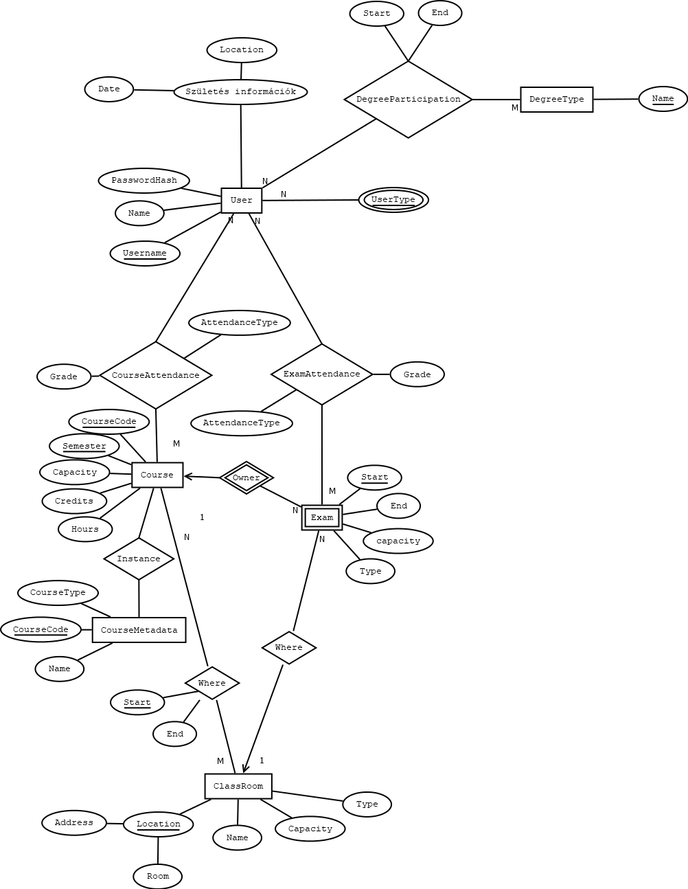
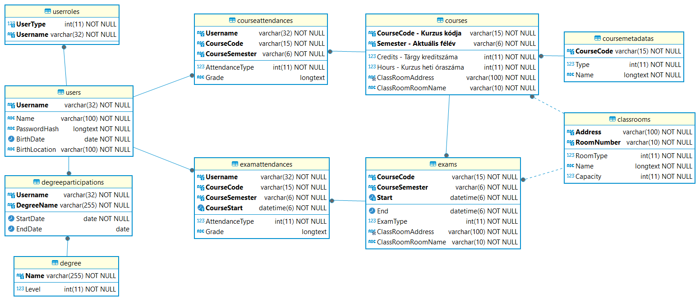

# Adatbázis beadandó: ETR

## Projektben felhasznált technológia

### Kiszolgáló

A projekt a DotNet ökoszisztémában készült el C# nyelven. A kiszolgáló az AspNet Core keretrendszert használja a webes felület megvalósítására. Az adatbázis kezelésére az Entity Framework Core-t használja. További függőségek a [Skornel02.ETR.Api.csproj](./Skornel02.ETR.Api/Skornel02.ETR.Api.csproj) fájlban találhatóak.

### Web kliens

A projekt kliens oldali része a SvelteKit keretrendszert használja. A kliens oldali felület megvalósításához a PaperCSS keretrendszert használja. További függőségek a [package.json](./Skornel02.ETR.Web/package.json) fájlban találhatóak.

## Projekt futtatása

### Kiszolgáló
```bash
$# cd Skornel02.ETR.Api
$# dotnet run
```

### Web kliens
```bash
$# cd Skornel02.ETR.Web
$# npm install
$# npm run dev
```

## ​Specifikáció:

A feladat egy olyan elektronikus tanulmányi rendszer elkészítése, amely eltárolja a hallgatókat, oktatókat, kurzusokat és a terem információkat. A rendszerbe az emberek magukat regisztrálják. Az alkalmazás használatához be kell jelentkezni. Az oktatók tudnak kurzusokat és vizsgákat meghirdetni, amelyre a hallgatók jelentkezhetnek.

### ​Tárolt adatok (nem feltétlen jelentenek önálló táblákat):

- Felhasználó: felhasználó név, jelszó, név, születési dátum, születési hely, státusz, szak
- Kurzus: kód, cím, férőhely, jelleg, szemeszter, heti óraszám
- Vizsga: időpont, férőhely, jelleg
- Terem: cím, emelet, ajtó, név, férőhely, jelleg

> Adat megfeleltetés:
> - Felhasználó
>   - Felhasználó név: User.Username; A felhasználó azonsoító neve. Ez az egyed kulcsa.
>   - Jelszó: User.PasswordHard; A jelszó titkosítva. Ez az azonosítótól függ.
>   - Név: User.Name; A felhasználó neve, ez az azonosítótól függ.
>   - Születési dátum: User.BirthDate; A felhasználó születési dátuma, ez az azonosítótól függ.
>   - Születési hely: User.BirthLocation; A felhasználó születési helye, ez az azonsoítótól függ.
>   - Státusz: UserRole.RoleType; A felhaszáló státusza a rendszerben, lehet több érték is egyszerre.
>   - Szak: Degree.Name; A felhasználó által (el)végzett szak(ok). 
> - Kurzus
>   - Kód: Course.CourseCode; A kurzus kódja. Ez az egyed kulcsa.
>   - Szemeszter: Course.Semester; A kurzus szemesztere. Ez az egyed kulcsa.
>   - Cím: CourseMetadata.Name; A kurzus címe. Ez a kurzuskódtól függ (de a szemesztertől nem). 
>   - Férőhely: Course.Capacity; A kurzus max kapacitása. Ez a kurzus kódjától és szemeszterétől függ.
>   - Heti óraszám: Course.Hours; A kurzus óraszáma. Ez a kurzus kódjától és szemeszterétől függ.
>   = Jelleg: CourseMetadata.CourseType; A kurzus jellege. Ez a kurzuskódtól függ (de a szemesztertől nem).
> - Vizsga (gyenge egyed)
>   - Időpont: Exam.Start; A vizsga kezdési időpontja. Ez a gyenge egyed "kulcs tulajdonsága".
>   - Férőhely: Exam.Capacity: A vizsga férőhelye. 
>   - Jelleg: Exam.Type; A vzsga típusa.
> - Terem:
>   - Cím: ClassRoom.Address; A terem címe. Ez az egyed kulcsa.
>   - Emelet és ajtó: ClassRoom.Room; A terem elhelyezése. Ez az egyed kulcsa. Praktikai okokból összevonva, úgy sincs minidg az emelet értelmezve, továbbá az ajtó általában redundánsan tartalmazza ezt.
>   - Név: ClassRoom.Name; A terem fiktív neve. Ez opcionális. A terem címétől és elhelyezésétől függ.
>   - Férőhely: ClassRoom.Capacity; A terem férőhelyszáma. A terem címétől és elhelyezésétől függ.
>   - Jelleg: ClassRoom.Type; A terem típusa. A terem címétől és elhelyezésétől függ.

### ​Relációk az adatok között:

Egy termet egyszerre csak egy kurzus vagy vizsga lebonyolítására lehet lefoglalni. Egy oktató több kurzust oktathat és több vizsgát is kiírhat Egy vizsgát csak egy oktató írhat ki. Egy vizsgára több hallgató jelentkezhet, továbbá egy hallgató több vizsgára is jelentkezhet. Egy oktató több kurzust tarthat, valamint egy kurzust tarthat több öktató is?

> Feladat leírásából kigyűjthető elvárások: 
>  - Terem foglaltságát ellenőrizni kell! *ezt nem az adatbázis fogja végezni, mivel fedés ellenőrzésre nem képes*
>  - Oktató - Oktató által tartott kurzus => N:M
>  - Oktató - Oktató által tartott vizsga => 1:M
>  - Hallgató - Vizsga => N:M
>  - ( hallgató - kurzus => N:M )

<div class="page-break"></div>

### ​Megvalósítandó elemek (a pontszámok a funkciókra adható maximumot jelentik):

| | **Megvalósítandó elem** | **Pontszám** |
| --- | --- | --- | 
|  | **Dokumentáció** | |
| <ul><li>[x] </li></ul> | Az adatbázis modelljének E-K diagramja és annak értelmezése | 3 pont |
| <ul><li>[x] </li></ul> | Az E-K diagram leképezése relációs sémákká | 2 pont |
| <ul><li>[x] </li></ul> | Sémák normalizálása 3NF-ig, de legalább 2NF-ig, vagy indoklás, ha már a séma 2NF-ben vagy 3NF-ben van | 2 pont |
| <ul><li>[x] </li></ul> | Táblatervek: táblázat, ahol a sorokban az adatbázis táblák mezői szerepelnek, az oszlopokban a megnevezés, típus és megjegyzés szerepel | 1 pont |
| <ul><li>[ ] </li></ul> | A dokumentációban szerepelnek a program funkció és a felhasznált megvalósítás leírása | 1 pont |
| <ul><li>[ ] </li></ul> | A dokumentációban ki van gyűjtve a programból a három összetett lekérdezés és meg van jelölve, hogy melyik fájlban van megvalósítva. | Nem jár külön pontszám érte. <br> Hiánya esetén -2 pont. |
|  | **Funkciók** |  |
| <ul><li>[x] </li></ul> | Felhasználó regisztrációja űrlapon keresztül <br> <ul> <li>jelszó kétszeri megadása</li> <li>jelszó titkosítása</li> <li>visszajelzés a sikeres vagy sikertelen regisztrációról</li></ul> | 2 pont |
| <ul><li>[x] </li></ul> | Felhasználó bejelentkeztetése és kijelentkeztetése űrlapon keresztül <br> <ul><li>visszajelzés, hogy sikerült-e</li></ul> | 2 pont |
| <ul><li>[x] </li></ul> | Kurzusok meghirdetése oktató által. | 1 pont |
| <ul><li>[X] </li></ul> | Új vizsgák meghirdetése oktató által. | 2 pont |
| <ul><li>[x] </li></ul> | Kurzus és vizsga törlése oktató által. | 1 pont |
| <ul><li>[x] </li></ul> | Vizsgák módosítása oktató által. | 2 pont |
| <ul><li>[x] </li></ul> | Hallgató jelentkezése vizsgára és kurzusra | 2 pont |
| <ul><li>[x] </li></ul> | Termek kilistázása táblázatos formában. | 1 pont |
| <ul><li>[ ] </li></ul> | Listázza ki a felhasználó által választott kurzushoz tartozó vizsgaidőpontokat táblázatos formában. | 1 pont |
| <ul><li>[x] </li></ul> | Listázza ki az összes oktatót születési dátum szerint. A legfiatalabb oktató legyen elöl. | 1 pont |
| <ul><li>[x] </li></ul> | Listázza ki táblázatos formában a hallgatók által felvett kurzusok számát (hallgatók szerint ABC sorrendben). | 2 pont |
| <ul><li>[x] </li></ul> | Listázzuk ki táblázatos formában a legnagyobb férőhellyel rendelkező terembe meghirdetett vizsgákat és kurzusokat. | 2 pont |
| <ul><li>[x] </li></ul> | Listázza ki táblázatos formában a minden oktató által hetente megtartandó óraszámot. | 2 pont |

### ​Nem fogadható el a kötelező program, ha teljesül az alábbi kritériumok valamelyike:

- [ ] A dokumentáció nem egyetlen PDF dokumentumból áll, amelyben áttekinthetően szerepelnek a tervezés elemei.
- [ ] Normalizált és konszolidált adatbázis 4-nél kevesebb összefüggő táblát tartalmaz.
- [ ] Nincs 50 rekord, amivel be lehetne mutatni az alkalmazás működését.
- [ ] Az adattáblákban nincsenek beállítva a kulcs és külső kulcs feltételek.
- [ ] A program nem rendelkezik olyan felhasználói felülettel, amelyen keresztül az adatfelvitel meg van valósítva.
- [ ] A program nem rendelkezik olyan felhasználói felülettel, amelyen keresztül az adatlekérés meg van valósítva.
- [ ] A program nem alkalmas a kitűzött feladat ellátására.
- [ ] Nem sikerül beüzemelni, működésre bírni az alkalmazást a védés alkalmával.
- [ ] Az ***Funkciók*** elemekből nem ért el 10 pontot a hallgató.

<div class="page-break"></div>

## Adatstruktúra

### EK diagram



<div class="page-break"></div>

### Formalizálás

#### Felhasználó:
User(<ins>Username</ins>, Name, PasswordHard, BirthDate, BirthLocation)

- {Username} → {Name, BirthDate, BirthLocation}
- {Username} → {PasswordHash} 

#### Felhasználó típusa (oktató, hallgató):

UserTypeEntity(<ins>UserType</ins>, <ins>*Username*</ins>)

> A multi-value problémát úgy oldottam meg, hogy egy önálló táblát vettem fel, ahol a UserType egy enumként tárolja a felhasználó típusságot. 
> Ez egy optimális megoldás, mivel az enum értéke elég információt hordoz magában, további tábla kapcsolására nincs szükség.

#### Egyetemi végzettség:
Degree(<ins>Name</ins>, Level)

- {Name} → {Level}

> Adat duplikáció megszüntetése végett.

#### Felhasználó és egyetemi végzettség kapcsoló tábla:

DegreeParticipation(<ins>*Username*</ins>, <ins>*DegreeName*</ins>, StartDate, EndDate)

- {Username, DegreeName} → {StartDate, EndDate}

> Az `EndDate` tulajdonság nem kötelező, és ez jelöli, ha még a képzés folyamatban van.

#### Kurzus típus:

Course(<ins>*CourseCode*</ins>, <ins>Semester</ins> Capacity, Credits, Hours, *ClassRoomAddress*, *ClassRoomRoomName*)

- {CourseCode, Semester} → {Capacity, Credits, Hours}
- {CourseCode, Semester} → {ClassRoomAddress, ClassRoomRoomName}

> A CourseCode 15 karakterre, a Semester 6 max karakterre lett limitálva.

#### Kurzus részletei típus:

CourseMetadata(<ins>CourseCode</ins>, CourseType, Name)

- {CourseCode} → {CourseType, Name}

> Ennek a táblának a célja, hogy kurzus tábla rendundanciáját megszüntessük.

#### Kurzus részvétel:

CourseAttendance(<ins>*Username*</ins>, <ins>*CourseCode*</ins>, <ins>*CourseSemester*</ins>, AttendanceType, Grade)

- {Username, CourseCode, CourseSemester} → {AttendanceType, Grade}

> A kapcsolótábla tartalmazza a részvétel típusát (résztvevő, szervező) és opcionálisan az eredményt (természetesen ennek kitöltése csak akkor van értelmezve, ha a felhasználó résztvevő és az értékelés már megtörtént).

#### Vizsga típus:

Exam(<ins>*CourseCode*</ins>, <ins>*CourseSemester*</ins>, <ins>Start</ins>, End, Capacity, Type, *ClassRoomAddress*, *ClassRoomRoomName*)

- {CourseCode, CourseSemester, Start} → {End, Capacity, Type}
- {CourseCode, CourseSemester, Start} → {ClassRoomAddress, ClassRoomRoomName}

> A vizsga egy gyenge egyed, mivel kurzus nélkül nincs értelme. (Ha van tárgy nélküli vizsga az egyetemen, akkor személyesen kérek bocsánatot a védésnél.)

#### Vizsga részvétel típus:

ExamAttendance(<ins>*Username*</ins>, <ins>*CourseCode*</ins>, <ins>*CourseSemester*</ins>, <ins>*CourseStart*</ins>, AttendanceType, Grade)

- {Username, CourseCode, CourseSemster, CourseStart} → {AttendanceType, Grade}

> A kapcsolótábla tartalmazza a részvétel típusát (résztvevő, szervező) és opcionálisan az eredményt (természetesen ennek kitöltése csak akkor van értelmezve, ha a felhasználó résztvevő és az értékelés már megtörtént).

#### Tanterem (részvételi hely)

ClassRoom(<ins>Address</ins>, <ins>Room</ins>, Name, Capacity, RoomType)

- {Address, Room} → {Name, Capacity, RoomType} 

<div class="page-break"></div>

### Adatbázis struktúra



## TODO

- Felhasználó vizsga mutatás
- Felugró ablakok és átirányítások rendbeszedése
- Dokumentáció írás
- Ellenőrzés
- Feltöltés
