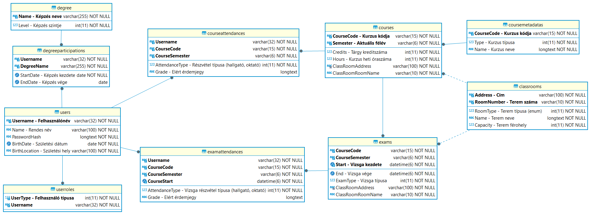
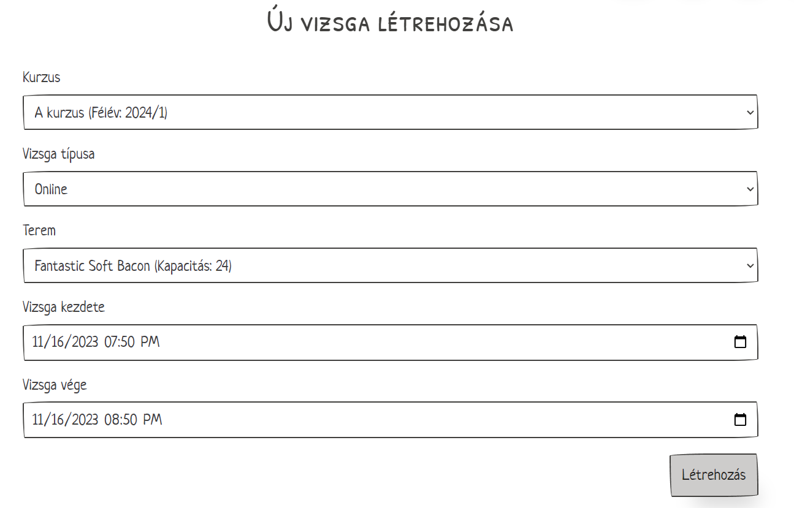

# <div class="header-page">Adatbázis beadandó: ETR </div>

<div class="page-break"></div>

## ​Specifikáció

> A feladat egy olyan elektronikus tanulmányi rendszer elkészítése, amely eltárolja a hallgatókat, oktatókat, kurzusokat és a terem információkat. A rendszerbe az emberek magukat regisztrálják. Az alkalmazás használatához be kell jelentkezni. Az oktatók tudnak kurzusokat és vizsgákat meghirdetni, amelyre a hallgatók jelentkezhetnek.

### ​Tárolt adatok (nem feltétlen jelentenek önálló táblákat)

> - Felhasználó: felhasználó név, jelszó, név, születési dátum, születési hely, státusz, szak
> - Kurzus: kód, cím, férőhely, jelleg, szemeszter, heti óraszám
> - Vizsga: időpont, férőhely, jelleg
> - Terem: cím, emelet, ajtó, név, férőhely, jelleg

 Adat megfeleltetés:
 - Felhasználó
   - Felhasználó név: User.Username; A felhasználó azonsoító neve. Ez az egyed kulcsa.
   - Jelszó: User.PasswordHard; A jelszó titkosítva. Ez az azonosítótól függ.
   - Név: User.Name; A felhasználó neve, ez az azonosítótól függ.
   - Születési dátum: User.BirthDate; A felhasználó születési dátuma, ez az azonosítótól függ.
   - Születési hely: User.BirthLocation; A felhasználó születési helye, ez az azonsoítótól függ.
   - Státusz: UserRole.RoleType; A felhaszáló státusza a rendszerben, lehet több érték is egyszerre.
   - Szak: Degree.Name; A felhasználó által (el)végzett szak(ok). 
 - Kurzus
   - Kód: Course.CourseCode; A kurzus kódja. Ez az egyed kulcsa.
   - Szemeszter: Course.Semester; A kurzus szemesztere. Ez az egyed kulcsa.
   - Cím: CourseMetadata.Name; A kurzus címe. Ez a kurzuskódtól függ (de a szemesztertől nem). 
   - Férőhely: Course.Capacity; A kurzus max kapacitása. Ez a kurzus kódjától és szemeszterétől függ.
   - Heti óraszám: Course.Hours; A kurzus óraszáma. Ez a kurzus kódjától és szemeszterétől függ.
   - Jelleg: CourseMetadata.CourseType; A kurzus jellege. Ez a kurzuskódtól függ (de a szemesztertől nem).
 - Vizsga (gyenge egyed)
   - Időpont: Exam.Start; A vizsga kezdési időpontja. Ez a gyenge egyed "kulcs tulajdonsága".
   - Férőhely: Exam.Capacity: A vizsga férőhelye. 
   - Jelleg: Exam.Type; A vzsga típusa.
 - Terem:
   - Cím: ClassRoom.Address; A terem címe. Ez az egyed kulcsa.
   - Emelet és ajtó: ClassRoom.Room; A terem elhelyezése. Ez az egyed kulcsa. Praktikai okokból összevonva, úgy sincs minidg az emelet értelmezve, továbbá az ajtó általában redundánsan tartalmazza ezt.
   - Név: ClassRoom.Name; A terem fiktív neve. Ez opcionális. A terem címétől és elhelyezésétől függ.
   - Férőhely: ClassRoom.Capacity; A terem férőhelyszáma. A terem címétől és elhelyezésétől függ.
   - Jelleg: ClassRoom.Type; A terem típusa. A terem címétől és elhelyezésétől függ.

<div class="page-break"></div>

### ​Relációk az adatok között:

> Egy termet egyszerre csak egy kurzus vagy vizsga lebonyolítására lehet lefoglalni. Egy oktató több kurzust oktathat és több vizsgát is kiírhat Egy vizsgát csak egy oktató írhat ki. Egy vizsgára több hallgató jelentkezhet, továbbá egy hallgató több vizsgára is jelentkezhet. Egy oktató több kurzust tarthat, valamint egy kurzust tarthat több öktató is?

Feladat leírásából kigyűjthető elvárások: 
 - Terem foglaltságát ellenőrizni kell!
 - Oktató - Oktató által tartott kurzus => N:M
 - Oktató - Oktató által tartott vizsga => 1:M
 - Hallgató - Vizsga => N:M
 - ( hallgató - kurzus => N:M )

A terem foglalás egy kellemetlen probléma, amit contstraitként felírni nem lehet, így a program fogja ellenőrizni. Egy terembe **csak egy** kurzust lehet tartani, de tetszőleges számú vizsgát egy időben (fedés nélkül).

Látható, hogy az oktató és hallgató részvételét nem éri meg külön kapcsolatba szétvenni, így az oktató által tartott vizsgát program kódból éri meg ellenőrizni, hogy egyedi-e.

<div class="page-break"></div>

## Adatstruktúra

### EK diagram


<div class="page-break"></div>

### Formalizálás

#### Felhasználó:
> User(<ins>Username</ins>, Name, PasswordHard, BirthDate, BirthLocation)

```
- {Username} → {Name, BirthDate, BirthLocation}
- {Username} → {PasswordHash} 
```

A tábla normálformában van, mivel egy kulcsa van és érdemi adatduplikációt nem tartalmaz.

#### Felhasználó típusa (oktató, hallgató):

> UserTypeEntity(<ins>UserType</ins>, <ins>*Username*</ins>)

A multi-value problémát úgy oldottam meg, hogy egy önálló táblát vettem fel, ahol a UserType egy enumként tárolja a felhasználó típusságot. 
*Ez egy optimális megoldás, mivel az enum értéke elég információt hordoz magában, további tábla kapcsolására nincs szükség.*

Mivel mindkét oszlopja kulcs, így normál formában van ez a tábla.


#### Egyetemi végzettség:
> Degree(<ins>Name</ins>, Level)

```
- {Name} → {Level}
```

Adat duplikáció megszüntetése végett az adott szakokhoz tároljuk a szintjüket. Itt jobb megvalósítás lenne, ha lenne egy futó egyedi azonosító oszlop, viszont ez nem tárgya ennek a kurzusnak.

#### Felhasználó és egyetemi végzettség kapcsoló tábla:

> DegreeParticipation(<ins>*Username*</ins>, <ins>*DegreeName*</ins>, StartDate, EndDate)

```
- {Username, DegreeName} → {StartDate, EndDate}
```

Az `EndDate` tulajdonság nem kötelező, és ez jelöli, ha még a képzés folyamatban van.

A tábla normál formában van, mivel a két dátum csak az adott kulcsoktól, a kapcsolattól függ.

#### Kurzus típus:

> Course(<ins>*CourseCode*</ins>, <ins>Semester</ins> Capacity, Credits, Hours, *ClassRoomAddress*, *ClassRoomRoomName*)

```
- {CourseCode, Semester} → {Capacity, Credits, Hours}
- {CourseCode, Semester} → {ClassRoomAddress, ClassRoomRoomName}
```

A CourseCode 15 karakterre, a Semester 6 max karakterre lett limitálva.

A tábla tartalmazza az `1:N` kapcsolatot a terem táblával.

Az osztály 3NF-ben van, mivel a tranzitív függése külön táblába (CourseMetadata) lett áthelyezve, még a tervezési fázisban.

#### Kurzus részletei típus:

> CourseMetadata(<ins>CourseCode</ins>, CourseType, Name)

```
- {CourseCode} → {CourseType, Name}
```

Ennek a táblának a célja, hogy kurzus tábla rendundanciáját megszüntessük.

Normálformában van, mivel ezek az oszlopok csak a kurzus kódjától függnek.

#### Kurzus részvétel:

> CourseAttendance(<ins>*Username*</ins>, <ins>*CourseCode*</ins>, <ins>*CourseSemester*</ins>, AttendanceType, Grade)

```
- {Username, CourseCode, CourseSemester} → {AttendanceType, Grade}
```

A kapcsolótábla tartalmazza a részvétel típusát (résztvevő, szervező) és opcionálisan az eredményt (természetesen ennek kitöltése csak akkor van értelmezve, ha a felhasználó résztvevő és az értékelés már megtörtént). 

Kapcsolótábla szerepe mellett ez is optimális formában van enumok használatával.

#### Vizsga típus:

> Exam(<ins>*CourseCode*</ins>, <ins>*CourseSemester*</ins>, <ins>Start</ins>, End, Capacity, Type, *ClassRoomAddress*, *ClassRoomRoomName*)

```
- {CourseCode, CourseSemester, Start} → {End, Capacity, Type}
- {CourseCode, CourseSemester, Start} → {ClassRoomAddress, ClassRoomRoomName}
```

A vizsga egy gyenge egyed, mivel kurzus nélkül nincs értelme. *(Ha van tárgy nélküli vizsga az egyetemen, akkor személyesen kérek bocsánatot a védésnél.)*

A tábla tartalmazza az `1:N` kapcsolatot a terem táblával. 

A tábla normálformában van, mivel csak a kulcsaitól függenek a tulajdonságai.


#### Vizsga részvétel típus:

> ExamAttendance(<ins>*Username*</ins>, <ins>*CourseCode*</ins>, <ins>*CourseSemester*</ins>, <ins>*CourseStart*</ins>, AttendanceType, Grade)

```
- {Username, CourseCode, CourseSemster, CourseStart} → {AttendanceType, Grade}
```

A kapcsolótábla tartalmazza a részvétel típusát (résztvevő, szervező) és opcionálisan az eredményt (természetesen ennek kitöltése csak akkor van értelmezve, ha a felhasználó résztvevő és az értékelés már megtörtént). 

A tábla optimális állapotban van hasonló okokból, mint a kurzus részével tábla.

#### Tanterem (részvételi hely)

> ClassRoom(<ins>Address</ins>, <ins>Room</ins>, Name, Capacity, RoomType)

```
- {Address, Room} → {Name, Capacity, RoomType} 
```

A táblának a két kulcsa egyértelműen meghatározza a tulajdonságait, így normál formában van.

A redundancia elkerülése végett a szoba típusát enumként tároljuk.

<div class="page-break"></div>

### Adatbázis struktúra

Az adatbázis az előző fejezet EK diagram értelmezéséből lett létrehozva. A megfelelő típusok az ábráról leolvashatóak.

Az adatbázis el van látva kommentekkel, hogy egyértelműsítsék az oszlopok szerepét.



Mindenhol, ahol a külső kulcsot tartalmazó oszlop nem vehet fel NULL, ott a **cascade törlésre van állítva**, a többi helyen viszont **nullra állítja**.

A megfelelő kulcs oszlopok hossza értelemszerűen megszabásra kerültek, hogy ne okozzanak felesleges tárkapacítás ígényt.

<div class="page-break"></div>


## Projektben felhasznált technológia

### Kiszolgáló

A projekt a DotNet ökoszisztémában készült el C# nyelven. A kiszolgáló az AspNet Core keretrendszert használja a webes felület megvalósítására. Az adatbázis kezelésére az Entity Framework Core-t használja. További függőségek a [Skornel02.ETR.Api.csproj](./Skornel02.ETR.Api/Skornel02.ETR.Api.csproj) fájlban találhatóak.

### Web kliens

A projekt kliens oldali része a SvelteKit keretrendszert használja. A kliens oldali felület megvalósításához a PaperCSS keretrendszert használja. További függőségek a [package.json](./Skornel02.ETR.Web/package.json) fájlban találhatóak.

## Projekt futtatása

### Kiszolgáló
```bash
$# cd Skornel02.ETR.Api
$# dotnet run
```

### Web kliens
```bash
$# cd Skornel02.ETR.Web
$# pnpm install
$# pnpm run dev
```

## Projekt futtatható elkészítése

```bash
$# pnpm install
$# pnpm run generate-program
```

Az eredmény a `./Skornel02.ETR.Api/bin/Release/net8.0/publish` mappában található. 

---

<div class="page-break"></div>

## Program funkciók

### Felhasználó regisztrációja

A felhasználó regisztrálhat egy olyan felületen, ahol dinamikus visszajelzést kap arról, hogy milyen elvárásoknak nem felel meg. Lehetősége van a jogköreit megválasztani és a jelszavát biztonsági okból kétszer kell megadnia. Ezt először és utoljára itt kezeljük csak szövegként a bejelentkezésen túl. 


A regisztráció folyamán adhatja meg a felhasználó a szakot amit kezd az egyetemen. 

Regisztrálás eredményét a kijelző jobb felső sarkán láthatjuk. 

Ha a programban felugró ablakokat látunk, akkor azok nem tűnnek el oldal váltás esetén, így informatívak maradnak.

---

### Bejelentkezés

A felhasználók számára két belépési felület létezik, az egyik a hallgató felületre vezet, a másik az oktató felületre.

|  |  |
| ------------------------------------------------- | --------------------------------------------- |

A bejelentkezés sikerességéről felugró ablakban értesítjük a felhasználót, továbbá átirányítjuk ha sikeres volt.

A programba egyszerre be lehet lépni tanulóként és oktatóként is. A kettő üzemmód egyszerre két böngésző fülben működik.

A hallgatók szerepköre limitált, így ők csak szűkös hasznoságot lelnek a programnak:
- Kurzusok listázása, felvétele, leadása
- Kurzusaikhoz vizsgákat vehetnek fel, adhatnak le

A hallgatókkal szemben az oktatók a következő funkciókat érik el:

- Kurzusokat hozhatnak létre
- Kurzusokat vehetnek fel oktatásra
- Kurzusokat adhatnak le oktatásról
- Kurzusokat törölhetnek
- Vizsgákat vehetnek fel kurzusokhoz
- Vizsgákat adhatnak le megtartásról
- Vizsgákat vehetnek fel megtartásra (ha más nem tartja)
- Vizsgákat szerkeszthetnek
- Vizsgákat törölhetnek
- Statisztikákat tekinthetnek meg

---

<div class="page-break"></div>
### Statisztikák

#### Oktatói statisztikák

Az oktatót kilistázva a fiatalabbtól az idősebbig.


Lekérdezés helye: 
`./Skornel02.ETR.Api/Endpoints/StatisticsEndpoints.cs`


Lekérdezés kódja:
```sql
SELECT u.Username, u.Name, u.BirthDate , u.BirthLocation FROM Users u
    INNER JOIN UserRoles r ON u.Username = r.Username
    WHERE r.UserType = 1
        ORDER BY u.BirthDate Desc
```

---

<div class="page-break"></div>

#### Hallgató terheltségi statisztikák

Hallgatók ABC sorrendben az általuk felvett kurzusok száma. 


Lekérdezés helye: 
`./Skornel02.ETR.Api/Endpoints/StatisticsEndpoints.cs`


Lekérdezés kódja:
```sql
SELECT u.Username, u.Name, COUNT(ca.CourseCode) as 'CourseCount' FROM Users u
    INNER JOIN UserRoles r ON u.Username = r.Username
    LEFT JOIN CourseAttendances ca ON u.Username = ca.Username
    WHERE r.UserType = 0 AND
        (ca.AttendanceType IS NULL OR ca.AttendanceType = 1)
    GROUP BY u.Username, u.Name
    ORDER BY u.Name Asc
```

---

<div class="page-break"></div>

### Legnagyobb terem statisztika

Megmutatja, hogy a legnagyobb kapacitású teremnek mekkora a kapacitása és hogy milyen kurzusok (max 1) és vizsgák vannak ott.


Lekérdezés helye: 
`./Skornel02.ETR.Api/Endpoints/StatisticsEndpoints.cs`

Lekérdezés kódja kurzusok:
```sql
SELECT c.CourseCode, c.Semester as 'CourseSemester' FROM Courses c
    INNER JOIN ClassRooms cr ON c.ClassRoomAddress = cr.Address 
        and c.ClassRoomRoomName = RoomNumber
    WHERE cr.Capacity = (SELECT capacity FROM ClassRooms
                            ORDER BY capacity Desc
                            LIMIT 1)
```

Lekérdezés kódja vizsgák:
```sql
SELECT e.CourseCode, e.CourseSemester, e.Start as 'ExamDate' FROM Exams e
    INNER JOIN ClassRooms cr ON e.ClassRoomAddress = cr.Address 
        and e.ClassRoomRoomName = RoomNumber
    WHERE cr.Capacity = (SELECT capacity FROM ClassRooms
                            ORDER BY capacity Desc
                            LIMIT 1)
```

---

<div class="page-break"></div>

### Oktató leterheltség

Mutatja, hogy az egyes oktatók az egyes félévben mennyi órányi órát tartanak.


Lekérdezés helye: 
`./Skornel02.ETR.Api/Endpoints/StatisticsEndpoints.cs`

Lekérdezés kódja:
```sql
SELECT u.Username, u.Name, c.Semester , sum(c.Hours) as 'Hours'
    FROM Users u
    INNER JOIN UserRoles r ON u.Username = r.Username
    INNER JOIN CourseAttendances ca ON u.Username = ca.Username 
    INNER JOIN Courses c  on c.CourseCode = ca.CourseCode and c.Semester = ca.CourseSemester 
    WHERE r.UserType = 1 AND ca.AttendanceType = 0
    GROUP BY u.Username, u.Name, c.Semester
    ORDER BY u.Name Asc, c.Semester Desc
```

---

<div class="page-break"></div>

### Hallgató kurzus felület

A hallgatóknak lehetősége van kurzusokat táblázatos formában megtekinteni. A kurzusok felvettség alapján két külön táblázatba vannak gyűjtve.

A hallgató felveheti és leadhatja a kurzusokat.


A kurzusokhoz meg lehet tekinteni a hozzájuk tartozó vizsgákat is.

---

### Hallgató vizsga felület

A kurzusokhoz hasonlóan a hallgató felvehet és leadhat vizsgákat.


---

### Kurzushoz tartozó vizsgák felület

Az előbb említett kurzus listában van lehetőség megtekinteni az egyes kurzusokhoz tartozó vizsgákat. Természetesen ezen a felületen lehet kurzust változtatni.


Ez a felület már az oktatók számára is elérhető.

---

### Termek listája

A termek listája csak az oktatók által megtekinthetőek, mert ez titkos. 

Itt látható a termek összes tulajdonsága.


---

### Oktatók kurzus felülete

Az oktatók a tanulókhoz képest egy bővebb kurzus felületet kapnak.

Itt van lehetőségük a kurzusokat oktatniuk, leadniuk, vagy azokhoz vizsgát hirdetni, ha oktatják őket.


Az oktatók a jobb felső sarokban létre is hozhatnak vzisgát, ahol ki kell választaniuk a megfelelő termet és megadniuk a kurzus információit.

Ha már létezik egy adott kurzus kódhoz tartozó leírás, akkor azt nem kell újra megadni, ha nem létezik akkor az létrejön az adatbázisban, és legközelebb nem kell megadni.


---

### Oktatók vizsga felülete

A kurzusokhoz hasonlóan az oktatók több funkciót érnek el a vizsgáknál, mint a hallgatók.

Az oktatóknak lehetősége van felvenni (más által nem tartott) vizsgát, vagy leadni a saját vizsgáikat.


Az általunk tartott vizsgának a végződési dátumát és típusát szabadon szerkeszthetjük.


Továbbá természetesen vehetünk fel új vizsgát, ahol ki kell választanunk a kurzust, a termet és meg kell adnunk a további információkat. 

Ha a kurzusok menüpontban nyomunk rá a vizsga hirdetésre, akkor előre kiválasztódik a megfelelő kurzus.




<div class="page-break"></div>

## Tesztelés

**Adatbázis neve:** `abbeadando`

**Adatbázis elérése:** helyi gépen (`localhost`) a `3306`-os porton. `root` felhasználóval jelszó nélkül.

Ha ezek a beálltások nem megfelelőek, akkor a program konfigurációs fájlában szerkeszthető connection string formájában.

### Program beálltás

`appsettings.json` tárolja.

```json
{
  "Logging": {
    "LogLevel": {
      "Default": "Information",
      "Microsoft.AspNetCore": "Warning"
    }
  },
  "ConnectionStrings": {
    "ETRContext": "Server=127.0.0.1;Database=abbeadando;Uid=root;"
  },
  "AllowedHosts": "*"
}
```

### Teszt adatok

Ha az adatbázis nem létezik megfelelő adatstruktúrával, akkor a program első indítással létrehozza azt.

Ha azt szeretnénk, hogy egy ismert állapotból induljunk, akkor töltsük be importálással a `dump.sql` fájlt.

<div class="page-break"></div>

#### Fiókok

| Felhasználó név | Jelszó   | Jog      |
| --------------- | -------- | -------- |
| `tanulo`        | `tanulo` | Hallgató |
| `oktato`        | `oktato` | Oktató   |
| mindenki más    | random   | random   |

## Formális követelmények

- [ ] A dokumentáció nem egyetlen PDF dokumentumból áll, amelyben áttekinthetően szerepelnek a tervezés elemei.
- [ ] Normalizált és konszolidált adatbázis 4-nél kevesebb összefüggő táblát tartalmaz.
- [ ] Nincs 50 rekord, amivel be lehetne mutatni az alkalmazás működését.
- [ ] Az adattáblákban nincsenek beállítva a kulcs és külső kulcs feltételek.
- [ ] A program nem rendelkezik olyan felhasználói felülettel, amelyen keresztül az adatfelvitel meg van valósítva.
- [ ] A program nem rendelkezik olyan felhasználói felülettel, amelyen keresztül az adatlekérés meg van valósítva.
- [ ] A program nem alkalmas a kitűzött feladat ellátására.
- [ ] Nem sikerül beüzemelni, működésre bírni az alkalmazást a védés alkalmával.
- [ ] Az ***Funkciók*** elemekből nem ért el 10 pontot a hallgató.
