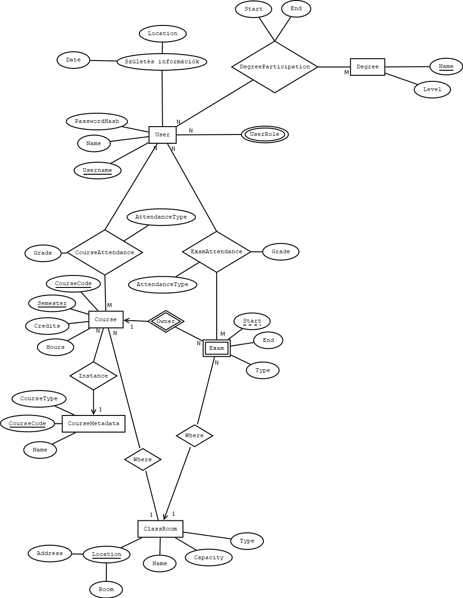

# Adatbázis beadandó: ETR

## ​Specifikáció:

A feladat egy olyan elektronikus tanulmányi rendszer elkészítése, amely eltárolja a hallgatókat, oktatókat, kurzusokat és a terem információkat. A rendszerbe az emberek magukat regisztrálják. Az alkalmazás használatához be kell jelentkezni. Az oktatók tudnak kurzusokat és vizsgákat meghirdetni, amelyre a hallgatók jelentkezhetnek.

### ​Tárolt adatok (nem feltétlen jelentenek önálló táblákat):

- Felhasználó: felhasználó név, jelszó, név, születési dátum, születési hely, státusz, szak
- Kurzus: kód, cím, férőhely, jelleg, szemeszter, heti óraszám
- Vizsga: időpont, férőhely, jelleg
- Terem: cím, emelet, ajtó, név, férőhely, jelleg

### ​Relációk az adatok között:

Egy termet egyszerre csak egy kurzus vagy vizsga lebonyolítására lehet lefoglalni. Egy oktató több kurzust oktathat és több vizsgát is kiírhat Egy vizsgát csak egy oktató írhat ki. Egy vizsgára több hallgató jelentkezhet, továbbá egy hallgató több vizsgára is jelentkezhet. Egy oktató több kurzust tarthat, valamint egy kurzust tarthat több öktató is?

### ​Megvalósítandó elemek (a pontszámok a funkciókra adható maximumot jelentik):

| | **Megvalósítandó elem** | **Pontszám** |
| --- | --- | --- | 
|  | **Dokumentáció** | |
| <ul><li>[ ] </li></ul> | Az adatbázis modelljének E-K diagramja és annak értelmezése | 3 pont |
| <ul><li>[ ] </li></ul> | Az E-K diagram leképezése relációs sémákká | 2 pont |
| <ul><li>[ ] </li></ul> | Sémák normalizálása 3NF-ig, de legalább 2NF-ig, vagy indoklás, ha már a séma 2NF-ben vagy 3NF-ben van | 2 pont |
| <ul><li>[ ] </li></ul> | Táblatervek: táblázat, ahol a sorokban az adatbázis táblák mezői szerepelnek, az oszlopokban a megnevezés, típus és megjegyzés szerepel | 1 pont |
| <ul><li>[ ] </li></ul> | A dokumentációban szerepelnek a program funkció és a felhasznált megvalósítás leírása | 1 pont |
| <ul><li>[ ] </li></ul> | A dokumentációban ki van gyűjtve a programból a három összetett lekérdezés és meg van jelölve, hogy melyik fájlban van megvalósítva. | Nem jár külön pontszám érte.   Hiánya esetén -2 pont. |
|  | **Funkciók** |  |
| <ul><li>[ ] </li></ul> | Felhasználó regisztrációja űrlapon keresztül   <ul> <li>jelszó kétszeri megadása</li> <li>jelszó titkosítása</li> <li>visszajelzés a sikeres vagy sikertelen regisztrációról</li></ul> | 2 pont |
| <ul><li>[ ] </li></ul> | Felhasználó bejelentkeztetése és kijelentkeztetése űrlapon keresztül   <ul><li>visszajelzés, hogy sikerült-e</li></ul> | 2 pont |
| <ul><li>[ ] </li></ul> | Új vizsgák meghirdetése oktató által. | 2 pont |
| <ul><li>[ ] </li></ul> | Vizsgák módosítása oktató által. | 2 pont |
| <ul><li>[ ] </li></ul> | Kurzusok meghirdetése oktató által. | 1 pont |
| <ul><li>[ ] </li></ul> | Kurzus és vizsga törlése oktató által. | 1 pont |
| <ul><li>[ ] </li></ul> | Hallgató jelentkezése vizsgára és kurzusra | 2 pont |
| <ul><li>[ ] </li></ul> | Termek kilistázása táblázatos formában. | 1 pont |
| <ul><li>[ ] </li></ul> | Listázza ki a felhasználó által választott kurzushoz tartozó vizsgaidőpontokat táblázatos formában. | 1 pont |
| <ul><li>[ ] </li></ul> | Listázza ki az összes oktatót születési dátum szerint. A legfiatalabb oktató legyen elöl. | 1 pont |
| <ul><li>[ ] </li></ul> | Listázza ki táblázatos formában a hallgatók által felvett kurzusok számát (hallgatók szerint ABC sorrendben). | 2 pont |
| <ul><li>[ ] </li></ul> | Listázzuk ki táblázatos formában a legnagyobb férőhellyel rendelkező terembe meghirdetett vizsgákat és kurzusokat. | 2 pont |
| <ul><li>[ ] </li></ul> | Listázza ki táblázatos formában a minden oktató által hetente megtartandó óraszámot. | 2 pont |

### ​Nem fogadható el a kötelező program, ha teljesül az alábbi kritériumok valamelyike:

- [ ] A dokumentáció nem egyetlen PDF dokumentumból áll, amelyben áttekinthetően szerepelnek a tervezés elemei.
- [ ] Normalizált és konszolidált adatbázis 4-nél kevesebb összefüggő táblát tartalmaz.
- [ ] Nincs 50 rekord, amivel be lehetne mutatni az alkalmazás működését.
- [ ] Az adattáblákban nincsenek beállítva a kulcs és külső kulcs feltételek.
- [ ] A program nem rendelkezik olyan felhasználói felülettel, amelyen keresztül az adatfelvitel meg van valósítva.
- [ ] A program nem rendelkezik olyan felhasználói felülettel, amelyen keresztül az adatlekérés meg van valósítva.
- [ ] A program nem alkalmas a kitűzött feladat ellátására.
- [ ] Nem sikerül beüzemelni, működésre bírni az alkalmazást a védés alkalmával.
- [ ] Az ***Funkciók*** elemekből nem ért el 10 pontot a hallgató.

## Adatstruktúra

### EK diagram

### Formalizálás

#### Felhasználó:
User(<u>Username</u>, EmailAddress, PasswordHard, BirthDate, BirthLocation)

- {Username} → {EmailAddress, PasswordHard, BirthDate, BirthLocation}

> Több felhasználó is rendelkezhet ugyan azzal az email címmel, mivel csak értesítési célt szolgál.

#### Egyetemi végzettség:
DegreeType(<u>Name</u>)

#### Felhasználó és egyetemi végzettség kapcsoló tábla:

DegreeParticipation(<u>*Username*</u>, <u>*DegreeName*</u>, StartDate, EndDate)

- {Username, DegreeName} → {StartDate, EndDate}

> Az `EndDate` tulajdonság nem kötelező, és ez jelöli, ha még a képzés folyamatban van.

#### Felhasználó típus:

UserTypeEntity(<u>UserType</u>, <u>*Username*</u>)

> A multi-value problémát úgy oldottam meg, hogy egy önálló táblát vettem fel, ahol a UserType egy enumként tárolja a felhasználó típusságot. 
> Ez egy optimális megoldás, mivel az enum értéke elég információt hordoz magában, további tábla kapcsolására nincs szükség.

